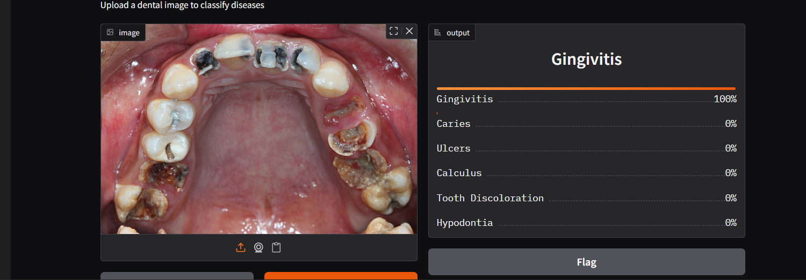

# 🦷 Dental Disease Classification using YOLO + Gradio

هذا المشروع يهدف إلى **تصنيف أمراض الأسنان** باستخدام نماذج YOLO مع واجهة رسومية عبر Gradio.

---

## 📂 هيكل المشروع
- `notebooks/` → يحتوي على النوتبوك:
  - **1_base_preprocessing.ipynb**: تجهيز البيانات والمعالجة الأساسية.
  - **2_training.ipynb**: تدريب الموديل وتحسينه باستخدام bestfile.
  - **3_deployment_gradio.ipynb**: نشر الموديل كواجهة باستخدام Gradio.
- `models/` → يحتوي على أفضل ملف للموديل (`lastDenatalClassifcationbestfile.pt`).
- `requirements.txt` → المكتبات المطلوبة.
- `README.md` → ملف التوثيق.
- `.gitignore` → استثناء الملفات غير المهمة.

---

## 🚀 طريقة التشغيل

### 1️⃣ تثبيت المتطلبات
```bash
pip install -r requirements.txt
```

### 2️⃣ تشغيل النوتبوك
افتح النوتبوك بالترتيب:
1. **Base Notebook** → تجهيز البيانات.  
2. **Training Notebook** → تدريب أو تحسين الموديل.  
3. **Deployment Notebook** → تشغيل واجهة Gradio.

### 3️⃣ تشغيل واجهة Gradio مباشرة
```bash
python notebooks/3_deployment_gradio.ipynb
```

---

## 📊 الفئات التي يدعمها النموذج
- Calculus  
- Caries  
- Gingivitis  
- Ulcers  
- Tooth Discoloration  
- Hypodontia  

---

## 🖼️ مثال على الواجهة



---

## 👨‍💻 المساهم
- **Mina Nabil**
